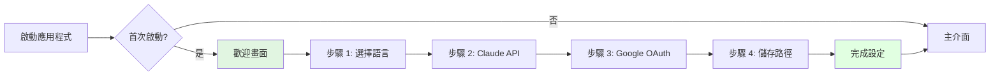

# AutoDoc Agent v2.0 - GUI 設定介面設計

## 📋 文檔導航

← [Task 12 實作](v2_desktop_task12.md) | [打包策略 →](v2_desktop_packaging.md)

---

## 設定視窗設計

### 整體佈局

```
┌──────────────────────────────────────────────────────────┐
│  ⚙️ 設定                                    [最小化] [關閉] │
├────────────────┬─────────────────────────────────────────┤
│                │                                         │
│  📋 基本設定    │  ┌─────────────────────────────────────┐│
│  🔐 認證設定    │  │                                     ││
│  🔍 探索設定    │  │                                     ││
│  💾 儲存設定    │  │       設定內容區域                   ││
│  ⚡ 進階選項    │  │                                     ││
│                │  │                                     ││
│                │  └─────────────────────────────────────┘│
│                │                                         │
│                │  ┌─────────────────────────────────────┐│
│                │  │  [重置為預設]        [套用] [確定]  ││
│                │  └─────────────────────────────────────┘│
└────────────────┴─────────────────────────────────────────┘
```

### React 組件結構

```typescript
// desktop/src/components/SettingsWindow.tsx
import React, { useState, useEffect } from 'react';
import { invoke } from '@tauri-apps/api/tauri';
import { Tabs, Form, message } from 'antd';
import {
  BasicSettingsTab,
  AuthSettingsTab,
  ExplorationSettingsTab,
  StorageSettingsTab,
  AdvancedSettingsTab
} from './SettingsTabs';

const SettingsWindow: React.FC = () => {
  const [form] = Form.useForm();
  const [config, setConfig] = useState(null);
  const [loading, setLoading] = useState(false);

  useEffect(() => {
    loadConfig();
  }, []);

  const loadConfig = async () => {
    try {
      const cfg = await invoke('load_config');
      setConfig(cfg);
      form.setFieldsValue(cfg);
    } catch (error) {
      message.error('載入配置失敗: ' + error);
    }
  };

  const handleSave = async () => {
    try {
      setLoading(true);
      const values = form.getFieldsValue();
      
      // 驗證配置
      await invoke('validate_config', { config: values });
      
      // 保存配置
      await invoke('save_config', { config: values });
      
      message.success('配置已保存');
    } catch (error) {
      message.error('保存失敗: ' + error);
    } finally {
      setLoading(false);
    }
  };

  const handleReset = async () => {
    try {
      const defaultConfig = await invoke('get_default_config');
      form.setFieldsValue(defaultConfig);
      message.info('已重置為預設值');
    } catch (error) {
      message.error('重置失敗: ' + error);
    }
  };

  return (
    <div className="settings-window h-screen flex flex-col">
      <div className="flex-1 p-6">
        <Form form={form} layout="vertical">
          <Tabs
            tabPosition="left"
            items={[
              {
                key: 'basic',
                label: '📋 基本設定',
                children: <BasicSettingsTab />,
              },
              {
                key: 'auth',
                label: '🔐 認證設定',
                children: <AuthSettingsTab />,
              },
              {
                key: 'exploration',
                label: '🔍 探索設定',
                children: <ExplorationSettingsTab />,
              },
              {
                key: 'storage',
                label: '💾 儲存設定',
                children: <StorageSettingsTab />,
              },
              {
                key: 'advanced',
                label: '⚡ 進階選項',
                children: <AdvancedSettingsTab />,
              },
            ]}
          />
        </Form>
      </div>
      
      <div className="border-t p-4 flex justify-between">
        <Button onClick={handleReset}>重置為預設</Button>
        <div className="space-x-2">
          <Button onClick={handleSave} loading={loading}>
            套用
          </Button>
          <Button type="primary" onClick={handleSave} loading={loading}>
            確定
          </Button>
        </div>
      </div>
    </div>
  );
};

export default SettingsWindow;
```

---

## 頁籤 1: 基本設定

### UI 設計

```
┌───────────────────────────────────────────────────────┐
│  應用程式設定                                          │
│                                                       │
│  應用程式名稱                                          │
│  ┌─────────────────────────────────────────────────┐ │
│  │ AutoDoc Agent                                   │ │
│  └─────────────────────────────────────────────────┘ │
│                                                       │
│  介面語言                                              │
│  ┌─────────────────────────────────────────────────┐ │
│  │ 繁體中文 ▼                                       │ │
│  └─────────────────────────────────────────────────┘ │
│  • 繁體中文  • 简体中文  • English                    │
│                                                       │
│  ☑ 開機自動啟動                                       │
│  ☑ 最小化到系統托盤                                   │
│  ☑ 自動檢查更新                                       │
│                                                       │
└───────────────────────────────────────────────────────┘
```

### React 組件

```typescript
// desktop/src/components/SettingsTabs/BasicSettingsTab.tsx
import React from 'react';
import { Form, Input, Select, Switch } from 'antd';

const BasicSettingsTab: React.FC = () => {
  return (
    <div className="space-y-6">
      <div>
        <h3 className="text-lg font-semibold mb-4">應用程式設定</h3>
        
        <Form.Item 
          name={['basic', 'app_name']} 
          label="應用程式名稱"
          tooltip="顯示在標題列的名稱"
        >
          <Input placeholder="AutoDoc Agent" />
        </Form.Item>
        
        <Form.Item 
          name={['basic', 'language']} 
          label="介面語言"
        >
          <Select>
            <Select.Option value="zh-TW">繁體中文</Select.Option>
            <Select.Option value="zh-CN">简体中文</Select.Option>
            <Select.Option value="en">English</Select.Option>
          </Select>
        </Form.Item>
      </div>
      
      <div>
        <h3 className="text-lg font-semibold mb-4">啟動選項</h3>
        
        <Form.Item 
          name={['basic', 'auto_start']} 
          label="開機自動啟動" 
          valuePropName="checked"
        >
          <Switch />
        </Form.Item>
        
        <Form.Item 
          name={['basic', 'minimize_to_tray']} 
          label="最小化到系統托盤" 
          valuePropName="checked"
        >
          <Switch />
        </Form.Item>
        
        <Form.Item 
          name={['basic', 'check_updates']} 
          label="自動檢查更新" 
          valuePropName="checked"
        >
          <Switch />
        </Form.Item>
      </div>
    </div>
  );
};

export default BasicSettingsTab;
```

---

## 頁籤 2: 認證設定

### UI 設計

```
┌───────────────────────────────────────────────────────┐
│  Claude API 設定                                       │
│                                                       │
│  API Key *                                            │
│  ┌─────────────────────────────────────────────────┐ │
│  │ sk-ant-api03-... ●●●●●●●●●        [顯示] [測試] │ │
│  └─────────────────────────────────────────────────┘ │
│  ✓ 連線成功                                           │
│                                                       │
│  模型選擇                                              │
│  ┌─────────────────────────────────────────────────┐ │
│  │ claude-sonnet-4-20250514 ▼                      │ │
│  └─────────────────────────────────────────────────┘ │
│                                                       │
│  ─────────────────────────────────────────────────── │
│                                                       │
│  Google Docs API 設定                                 │
│                                                       │
│  OAuth 憑證檔案                                        │
│  ┌────────────────────────────────────────┬────────┐ │
│  │ C:\Users\...\credentials.json          │ 瀏覽   │ │
│  └────────────────────────────────────────┴────────┘ │
│                                                       │
│  [ 開始 OAuth 授權 ]                                  │
│  ✓ 已授權                                             │
│                                                       │
│  ─────────────────────────────────────────────────── │
│                                                       │
│  Chrome MCP 設定                                       │
│                                                       │
│  MCP Server URL                                       │
│  ┌────────────────────┬────────────────────────────┐ │
│  │ http://localhost   │ 埠號: 3001                 │ │
│  └────────────────────┴────────────────────────────┘ │
│                                                       │
└───────────────────────────────────────────────────────┘
```

### React 組件

```typescript
// desktop/src/components/SettingsTabs/AuthSettingsTab.tsx
import React, { useState } from 'react';
import { Form, Input, Select, Button, message, Space } from 'antd';
import { EyeOutlined, EyeInvisibleOutlined, CheckCircleOutlined } from '@ant-design/icons';
import { invoke } from '@tauri-apps/api/tauri';
import { open } from '@tauri-apps/api/dialog';

const AuthSettingsTab: React.FC = () => {
  const [showApiKey, setShowApiKey] = useState(false);
  const [testingConnection, setTestingConnection] = useState(false);
  const [connectionStatus, setConnectionStatus] = useState<'idle' | 'success' | 'error'>('idle');

  const handleTestClaudeApi = async () => {
    setTestingConnection(true);
    try {
      const apiKey = form.getFieldValue(['auth', 'claude_api_key']);
      // 實際測試 API 連線
      await invoke('test_claude_api', { apiKey });
      setConnectionStatus('success');
      message.success('Claude API 連線成功');
    } catch (error) {
      setConnectionStatus('error');
      message.error('Claude API 連線失敗: ' + error);
    } finally {
      setTestingConnection(false);
    }
  };

  const handleBrowseCredentials = async () => {
    const selected = await open({
      filters: [{
        name: 'JSON',
        extensions: ['json']
      }]
    });
    
    if (selected && typeof selected === 'string') {
      form.setFieldsValue({
        auth: {
          google_credentials_path: selected
        }
      });
    }
  };

  const handleOAuthAuthorize = async () => {
    try {
      // 觸發 OAuth 流程
      await invoke('start_google_oauth');
      message.success('OAuth 授權成功');
    } catch (error) {
      message.error('OAuth 授權失敗: ' + error);
    }
  };

  return (
    <div className="space-y-8">
      {/* Claude API */}
      <div>
        <h3 className="text-lg font-semibold mb-4">Claude API 設定</h3>
        
        <Form.Item 
          name={['auth', 'claude_api_key']} 
          label="API Key"
          rules={[{ required: true, message: '請輸入 Claude API Key' }]}
        >
          <Input.Password
            placeholder="sk-ant-api03-..."
            iconRender={(visible) => (visible ? <EyeOutlined /> : <EyeInvisibleOutlined />)}
            addonAfter={
              <Button 
                size="small" 
                onClick={handleTestClaudeApi}
                loading={testingConnection}
              >
                測試
              </Button>
            }
          />
        </Form.Item>
        
        {connectionStatus === 'success' && (
          <div className="text-green-600 flex items-center gap-2">
            <CheckCircleOutlined /> 連線成功
          </div>
        )}
        
        <Form.Item name={['auth', 'claude_model']} label="模型選擇">
          <Select>
            <Select.Option value="claude-sonnet-4-20250514">
              Claude Sonnet 4 (推薦)
            </Select.Option>
            <Select.Option value="claude-opus-4-20250514">
              Claude Opus 4 (最強)
            </Select.Option>
          </Select>
        </Form.Item>
      </div>

      {/* Google Docs API */}
      <div>
        <h3 className="text-lg font-semibold mb-4">Google Docs API 設定</h3>
        
        <Form.Item 
          name={['auth', 'google_credentials_path']} 
          label="OAuth 憑證檔案"
        >
          <Input 
            readOnly
            placeholder="選擇 credentials.json 檔案"
            addonAfter={
              <Button size="small" onClick={handleBrowseCredentials}>
                瀏覽
              </Button>
            }
          />
        </Form.Item>
        
        <Button onClick={handleOAuthAuthorize}>
          開始 OAuth 授權
        </Button>
      </div>

      {/* Chrome MCP */}
      <div>
        <h3 className="text-lg font-semibold mb-4">Chrome MCP 設定</h3>
        
        <Space.Compact className="w-full">
          <Form.Item 
            name={['auth', 'chrome_mcp_url']} 
            label="MCP Server URL"
            className="flex-1"
          >
            <Input placeholder="http://localhost" />
          </Form.Item>
          
          <Form.Item 
            name={['auth', 'chrome_mcp_port']} 
            label="埠號"
            className="w-32"
          >
            <Input placeholder="3001" type="number" />
          </Form.Item>
        </Space.Compact>
      </div>
    </div>
  );
};

export default AuthSettingsTab;
```

---

## 頁籤 3: 探索設定

### UI 設計

```
┌───────────────────────────────────────────────────────┐
│  探索策略                                              │
│                                                       │
│  ◉ 重要性優先（推薦）                                  │
│     優先探索重要功能，如按鈕、連結、表單等              │
│                                                       │
│  ○ 廣度優先 (BFS)                                     │
│     按層級依序探索所有元素                             │
│                                                       │
│  ○ 深度優先 (DFS)                                     │
│     深入探索單一路徑後再探索其他路徑                   │
│                                                       │
│  ─────────────────────────────────────────────────── │
│                                                       │
│  探索範圍                                              │
│                                                       │
│  最大深度                                              │
│  ●─────○────────────── 5                            │
│  1                    10                             │
│                                                       │
│  最大頁面數                                            │
│  ●────────────○──────── 100                          │
│  10                  1000                            │
│                                                       │
│  截圖品質                                              │
│  ┌─────────────────────────────────────────────────┐ │
│  │ 中 (推薦) ▼                                      │ │
│  └─────────────────────────────────────────────────┘ │
│  • 高 (檔案較大)  • 中 (推薦)  • 低 (檔案較小)        │
│                                                       │
│  ☑ 等待網路閒置後再截圖                               │
│                                                       │
└───────────────────────────────────────────────────────┘
```

### React 組件

```typescript
// desktop/src/components/SettingsTabs/ExplorationSettingsTab.tsx
import React from 'react';
import { Form, Radio, Slider, Select, Switch } from 'antd';

const ExplorationSettingsTab: React.FC = () => {
  return (
    <div className="space-y-6">
      <div>
        <h3 className="text-lg font-semibold mb-4">探索策略</h3>
        
        <Form.Item name={['exploration', 'strategy']}>
          <Radio.Group className="flex flex-col gap-3">
            <Radio value="importance">
              <div>
                <div className="font-medium">重要性優先（推薦）⭐</div>
                <div className="text-sm text-gray-500">
                  優先探索重要功能，如按鈕、連結、表單等
                </div>
              </div>
            </Radio>
            <Radio value="bfs">
              <div>
                <div className="font-medium">廣度優先 (BFS)</div>
                <div className="text-sm text-gray-500">
                  按層級依序探索所有元素
                </div>
              </div>
            </Radio>
            <Radio value="dfs">
              <div>
                <div className="font-medium">深度優先 (DFS)</div>
                <div className="text-sm text-gray-500">
                  深入探索單一路徑後再探索其他路徑
                </div>
              </div>
            </Radio>
          </Radio.Group>
        </Form.Item>
      </div>

      <div>
        <h3 className="text-lg font-semibold mb-4">探索範圍</h3>
        
        <Form.Item 
          name={['exploration', 'max_depth']} 
          label="最大深度"
        >
          <Slider 
            min={1} 
            max={10} 
            marks={{
              1: '1',
              5: '5',
              10: '10'
            }}
            tooltip={{
              formatter: (value) => `深度: ${value}`
            }}
          />
        </Form.Item>
        
        <Form.Item 
          name={['exploration', 'max_pages']} 
          label="最大頁面數"
        >
          <Slider 
            min={10} 
            max={1000} 
            marks={{
              10: '10',
              100: '100',
              1000: '1000'
            }}
            tooltip={{
              formatter: (value) => `${value} 頁`
            }}
          />
        </Form.Item>
        
        <Form.Item 
          name={['exploration', 'screenshot_quality']} 
          label="截圖品質"
        >
          <Select>
            <Select.Option value="high">高（檔案較大）</Select.Option>
            <Select.Option value="medium">中（推薦）⭐</Select.Option>
            <Select.Option value="low">低（檔案較小）</Select.Option>
          </Select>
        </Form.Item>
        
        <Form.Item 
          name={['exploration', 'wait_for_network_idle']} 
          label="等待網路閒置後再截圖" 
          valuePropName="checked"
          tooltip="確保動態內容載入完成"
        >
          <Switch />
        </Form.Item>
      </div>
    </div>
  );
};

export default ExplorationSettingsTab;
```

---

## 頁籤 4: 儲存設定

### UI 設計

```
┌───────────────────────────────────────────────────────┐
│  儲存路徑                                              │
│                                                       │
│  快照儲存路徑                                          │
│  ┌────────────────────────────────────────┬────────┐ │
│  │ ~/Documents/AutoDoc/snapshots          │ 瀏覽   │ │
│  └────────────────────────────────────────┴────────┘ │
│                                                       │
│  截圖儲存路徑                                          │
│  ┌────────────────────────────────────────┬────────┐ │
│  │ ~/Documents/AutoDoc/screenshots        │ 瀏覽   │ │
│  └────────────────────────────────────────┴────────┘ │
│                                                       │
│  資料庫路徑                                            │
│  ┌────────────────────────────────────────┬────────┐ │
│  │ ~/Documents/AutoDoc/autodoc.db         │ 瀏覽   │ │
│  └────────────────────────────────────────┴────────┘ │
│                                                       │
│  ─────────────────────────────────────────────────── │
│                                                       │
│  儲存選項                                              │
│                                                       │
│  ☑ 啟用壓縮（節省空間）                               │
│  ☐ 自動清理舊資料                                     │
│                                                       │
│  保留天數 (0 = 永久保留)                              │
│  ●──○─────────────── 0                               │
│  0                  365                              │
│                                                       │
└───────────────────────────────────────────────────────┘
```

---

## 頁籤 5: 進階選項

### UI 設計

```
┌───────────────────────────────────────────────────────┐
│  日誌設定                                              │
│                                                       │
│  日誌等級                                              │
│  ┌─────────────────────────────────────────────────┐ │
│  │ Info ▼                                          │ │
│  └─────────────────────────────────────────────────┘ │
│  • Debug  • Info  • Warn  • Error                    │
│                                                       │
│  ─────────────────────────────────────────────────── │
│                                                       │
│  性能設定                                              │
│                                                       │
│  並行標籤頁數                                          │
│  ●────○──────────── 3                                │
│  1                 5                                 │
│                                                       │
│  API 調用限制 (每分鐘)                                │
│  ●───────○───────── 20                               │
│  10               60                                 │
│                                                       │
│  ─────────────────────────────────────────────────── │
│                                                       │
│  其他選項                                              │
│                                                       │
│  ☐ 啟用匿名使用統計                                   │
│                                                       │
│  HTTP 代理 (選填)                                     │
│  ┌─────────────────────────────────────────────────┐ │
│  │ http://proxy.example.com:8080                   │ │
│  └─────────────────────────────────────────────────┘ │
│                                                       │
└───────────────────────────────────────────────────────┘
```

---

## 首次啟動精靈

### 流程設計



### React 組件

```typescript
// desktop/src/components/WelcomeWizard.tsx
import React, { useState } from 'react';
import { Steps, Button, Form, message } from 'antd';
import { invoke } from '@tauri-apps/api/tauri';

const WelcomeWizard: React.FC<{ onComplete: () => void }> = ({ onComplete }) => {
  const [current, setCurrent] = useState(0);
  const [form] = Form.useForm();

  const steps = [
    {
      title: '歡迎',
      content: <WelcomeStep />,
    },
    {
      title: '語言',
      content: <LanguageStep />,
    },
    {
      title: 'Claude API',
      content: <ClaudeApiStep />,
    },
    {
      title: 'Google OAuth',
      content: <GoogleOAuthStep />,
    },
    {
      title: '儲存路徑',
      content: <StorageStep />,
    },
    {
      title: '完成',
      content: <CompleteStep />,
    },
  ];

  const next = () => {
    setCurrent(current + 1);
  };

  const prev = () => {
    setCurrent(current - 1);
  };

  const handleFinish = async () => {
    try {
      const values = form.getFieldsValue();
      await invoke('save_config', { config: values });
      message.success('設定完成！');
      onComplete();
    } catch (error) {
      message.error('保存設定失敗: ' + error);
    }
  };

  return (
    <div className="h-screen flex flex-col p-8">
      <Steps current={current} items={steps.map(s => ({ title: s.title }))} />
      
      <div className="flex-1 my-8">
        <Form form={form} layout="vertical">
          {steps[current].content}
        </Form>
      </div>
      
      <div className="flex justify-between">
        {current > 0 && (
          <Button onClick={prev}>上一步</Button>
        )}
        {current < steps.length - 1 && (
          <Button type="primary" onClick={next}>下一步</Button>
        )}
        {current === steps.length - 1 && (
          <Button type="primary" onClick={handleFinish}>完成設定</Button>
        )}
      </div>
    </div>
  );
};

export default WelcomeWizard;
```

---

**下一份文檔**: [打包與發佈策略 →](v2_desktop_packaging.md)
