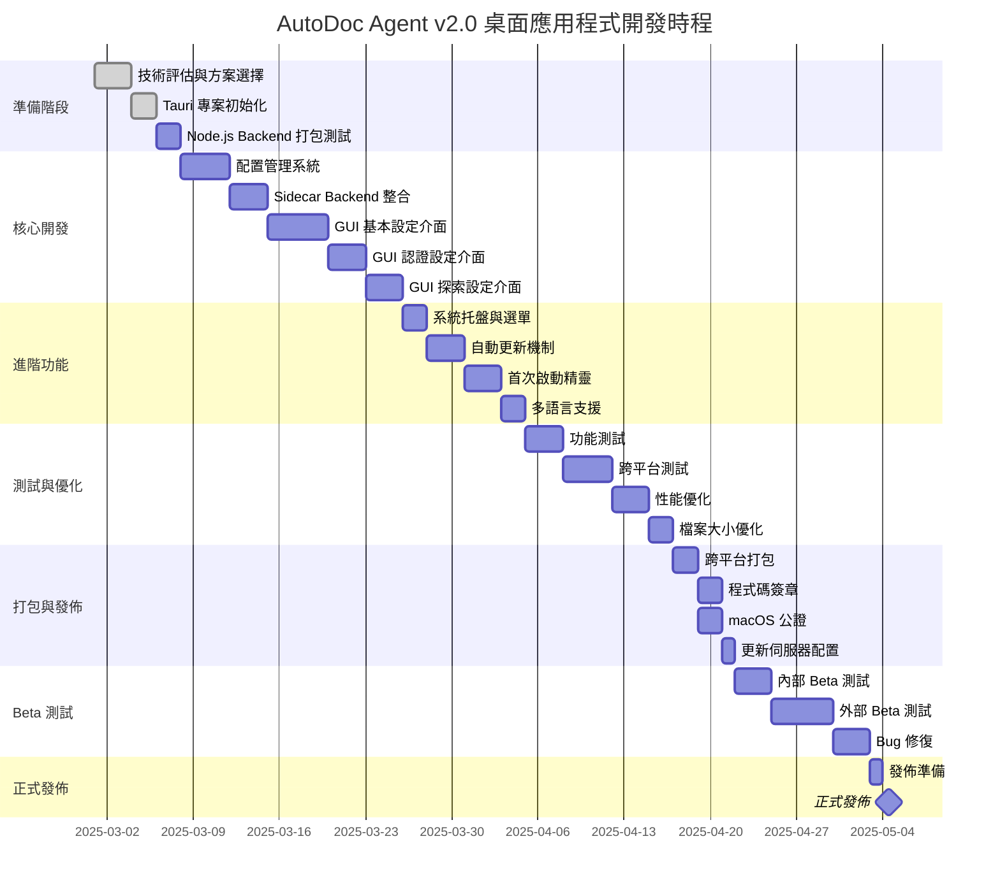

# AutoDoc Agent v2.0 - 實施計劃與測試

## 📋 文檔導航

← [打包策略](v2_desktop_packaging.md) | [返回概述](v2_desktop_overview.md)

---

## 開發時程

### Gantt 圖



### 里程碑

| 里程碑 | 日期 | 交付內容 | 驗收標準 |
|--------|------|----------|----------|
| **M1**: 技術驗證 | Week 1 | POC 完成 | Tauri 可啟動，配置可讀寫 |
| **M2**: 核心功能 | Week 2 | Sidecar + 基本 GUI | Backend 正常運作，設定可用 |
| **M3**: 完整 GUI | Week 3 | 所有設定頁籤 | 5 個頁籤全部可用 |
| **M4**: 進階功能 | Week 4 | 托盤 + 更新 | 所有進階功能測試通過 |
| **M5**: Alpha 版 | Week 5 | 可打包測試版 | 跨平台打包成功 |
| **M6**: Beta 版 | Week 6-7 | 外部測試版 | 主要 Bug 已修復 |
| **M7**: 正式版 | Week 8 | v2.0.0 | 所有測試通過，文檔完整 |

---

## 工作分配

### 團隊組成（建議）

| 角色 | 人數 | 主要職責 |
|------|------|----------|
| **Rust 開發者** | 1 人 | Tauri 核心、配置管理、Sidecar |
| **前端開發者** | 2 人 | React GUI、設定介面、首次精靈 |
| **後端開發者** | 1 人 | Node.js Backend 打包、API 整合 |
| **QA 測試人員** | 1 人 | 跨平台測試、回歸測試 |
| **DevOps** | 0.5 人 | CI/CD、發佈自動化 |

### 任務分配矩陣

| Subtask | Rust | 前端 | 後端 | QA | 預估時間 |
|---------|------|------|------|----|-|
| 12.1 Tauri 專案結構 | ● | ○ | | | 2天 |
| 12.2 配置管理系統 | ● | ○ | | | 4天 |
| 12.3 Sidecar 整合 | ● | | ● | | 3天 |
| 12.4 系統托盤 | ● | | | | 2天 |
| 12.5 自動更新 | ● | ○ | | | 3天 |
| 12.6 基本設定 GUI | | ● | | | 3天 |
| 12.7 認證設定 GUI | | ● | | | 3天 |
| 12.8 探索設定 GUI | | ● | | | 3天 |
| 12.9 儲存設定 GUI | | ● | | | 2天 |
| 12.10 進階設定 GUI | | ● | | | 2天 |
| 12.11 首次啟動精靈 | | ● | | | 3天 |
| 12.12 多語言支援 | ○ | ● | | | 2天 |
| 12.13 功能測試 | | | | ● | 3天 |
| 12.14 跨平台測試 | | | | ● | 4天 |
| 12.15 打包與發佈 | ● | | | ○ | 3天 |

**圖例**：● 主要負責 | ○ 協助支援

---

## 測試策略

### 測試金字塔

```
        /\
       /E2E\        <-- E2E Tests (10%)
      /──────\
     /整合測試\      <-- Integration Tests (30%)
    /──────────\
   /  單元測試  \    <-- Unit Tests (60%)
  /──────────────\
```

### 單元測試

#### Rust 單元測試

```rust
// src-tauri/src/config.rs
#[cfg(test)]
mod tests {
    use super::*;

    #[test]
    fn test_default_config() {
        let config = AppConfig::default();
        assert_eq!(config.basic.language, "zh-TW");
        assert_eq!(config.exploration.max_depth, 5);
    }

    #[test]
    fn test_validate_config() {
        let mut config = AppConfig::default();
        
        // 有效配置
        config.auth.claude_api_key = "sk-ant-api03-test".to_string();
        assert!(validate_config(config.clone()).is_ok());
        
        // 無效配置
        config.auth.claude_api_key = String::new();
        assert!(validate_config(config).is_err());
    }

    #[test]
    fn test_save_and_load_config() {
        let config = AppConfig::default();
        save_config(config.clone()).unwrap();
        
        let loaded = load_config().unwrap();
        assert_eq!(loaded.basic.language, config.basic.language);
    }
}
```

#### React 單元測試

```typescript
// desktop/src/components/__tests__/SettingsWindow.test.tsx
import { render, screen, fireEvent } from '@testing-library/react';
import SettingsWindow from '../SettingsWindow';

describe('SettingsWindow', () => {
  test('renders all setting tabs', () => {
    render(<SettingsWindow />);
    
    expect(screen.getByText('基本設定')).toBeInTheDocument();
    expect(screen.getByText('認證設定')).toBeInTheDocument();
    expect(screen.getByText('探索設定')).toBeInTheDocument();
    expect(screen.getByText('儲存設定')).toBeInTheDocument();
    expect(screen.getByText('進階選項')).toBeInTheDocument();
  });

  test('saves config on button click', async () => {
    const { getByText } = render(<SettingsWindow />);
    
    const saveButton = getByText('確定');
    fireEvent.click(saveButton);
    
    // 驗證 invoke 被調用
    expect(mockInvoke).toHaveBeenCalledWith('save_config', expect.any(Object));
  });

  test('resets config to default', async () => {
    const { getByText } = render(<SettingsWindow />);
    
    const resetButton = getByText('重置為預設');
    fireEvent.click(resetButton);
    
    expect(mockInvoke).toHaveBeenCalledWith('get_default_config');
  });
});
```

---

### 整合測試

#### Sidecar 整合測試

```rust
#[cfg(test)]
mod sidecar_tests {
    use super::*;

    #[tokio::test]
    async fn test_backend_start_and_stop() {
        let mut backend = BackendProcess::new();
        
        // 啟動後端
        backend.start(3000).unwrap();
        
        // 等待啟動
        tokio::time::sleep(tokio::time::Duration::from_secs(2)).await;
        
        // 檢查健康狀態
        let health = check_backend_health().unwrap();
        assert!(health);
        
        // 停止後端
        backend.stop().unwrap();
        
        // 確認已停止
        tokio::time::sleep(tokio::time::Duration::from_secs(1)).await;
        let health = check_backend_health().unwrap();
        assert!(!health);
    }
}
```

#### GUI 整合測試

```typescript
// desktop/src/__tests__/integration/settings-flow.test.tsx
describe('Settings Flow Integration', () => {
  test('complete settings flow', async () => {
    const { getByText, getByPlaceholderText } = render(<SettingsWindow />);
    
    // 1. 輸入 Claude API Key
    const apiKeyInput = getByPlaceholderText('sk-ant-api03-...');
    fireEvent.change(apiKeyInput, { target: { value: 'sk-test-key' } });
    
    // 2. 測試連線
    const testButton = getByText('測試');
    fireEvent.click(testButton);
    
    await waitFor(() => {
      expect(screen.getByText('連線成功')).toBeInTheDocument();
    });
    
    // 3. 保存配置
    const saveButton = getByText('確定');
    fireEvent.click(saveButton);
    
    await waitFor(() => {
      expect(mockInvoke).toHaveBeenCalledWith('save_config', expect.objectContaining({
        auth: expect.objectContaining({
          claude_api_key: 'sk-test-key'
        })
      }));
    });
  });
});
```

---

### E2E 測試

#### WebDriver 測試

```typescript
// desktop/tests/e2e/complete-flow.spec.ts
import { test, expect } from '@playwright/test';

test.describe('AutoDoc Agent E2E', () => {
  test('first launch wizard', async ({ page }) => {
    // 1. 啟動應用程式
    await page.goto('tauri://localhost');
    
    // 2. 歡迎畫面
    await expect(page.getByText('歡迎使用 AutoDoc Agent')).toBeVisible();
    await page.getByText('下一步').click();
    
    // 3. 選擇語言
    await page.getByText('繁體中文').click();
    await page.getByText('下一步').click();
    
    // 4. 輸入 API Key
    await page.getByPlaceholder('sk-ant-api03-...').fill('sk-test-key');
    await page.getByText('下一步').click();
    
    // 5. Google OAuth
    await page.getByText('稍後設定').click();
    await page.getByText('下一步').click();
    
    // 6. 儲存路徑
    await page.getByText('使用預設路徑').click();
    await page.getByText('完成設定').click();
    
    // 7. 驗證主介面
    await expect(page.getByText('新增探索任務')).toBeVisible();
  });

  test('create exploration task', async ({ page }) => {
    await page.goto('tauri://localhost');
    
    // 輸入 URL
    await page.getByPlaceholder('https://example.com/app').fill('https://example.com');
    
    // 選擇策略
    await page.getByText('重要性優先').click();
    
    // 調整參數
    await page.locator('.ant-slider-handle').nth(0).click();
    
    // 開始探索
    await page.getByText('開始探索').click();
    
    // 驗證任務開始
    await expect(page.getByText('探索中...')).toBeVisible();
  });
});
```

---

### 跨平台測試

#### 測試矩陣

| 平台 | 版本 | 安裝類型 | 優先級 |
|------|------|----------|--------|
| Windows 10 | x64 | NSIS | 🔴 高 |
| Windows 11 | x64 | MSI | 🟡 中 |
| Windows 11 | x64 | Portable | 🟢 低 |
| macOS 12 | Intel | DMG | 🔴 高 |
| macOS 13 | Intel | DMG | 🟡 中 |
| macOS 13 | Apple Silicon | DMG | 🔴 高 |
| macOS 14 | Apple Silicon | DMG | 🟡 中 |
| Ubuntu 22.04 | x64 | AppImage | 🔴 高 |
| Ubuntu 22.04 | x64 | DEB | 🟡 中 |
| Fedora 38 | x64 | RPM | 🟢 低 |

#### 測試檢查清單

**基本功能**：
- [ ] 應用程式啟動（<3 秒）
- [ ] 配置載入與保存
- [ ] Backend Sidecar 啟動
- [ ] GUI 所有頁籤顯示正常
- [ ] 系統托盤顯示與操作
- [ ] 自動更新檢查

**平台特定**：

**Windows**：
- [ ] 開機自動啟動
- [ ] Windows Defender 不誤報
- [ ] 檔案關聯正常
- [ ] 卸載乾淨（無殘留）

**macOS**：
- [ ] Gatekeeper 通過
- [ ] 系統托盤圖示正常
- [ ] Touch Bar 支援（如有）
- [ ] Spotlight 搜尋可找到

**Linux**：
- [ ] 桌面圖示顯示
- [ ] 系統托盤圖示（GNOME/KDE）
- [ ] 權限設定正確
- [ ] 依賴項自動安裝

---

### 性能測試

#### 測試指標

| 指標 | 目標 | 可接受 | 警戒值 |
|------|------|--------|--------|
| **啟動時間** | <2s | <3s | >5s |
| **記憶體佔用（閒置）** | <50MB | <100MB | >150MB |
| **記憶體佔用（運作）** | <200MB | <300MB | >500MB |
| **CPU 使用率（閒置）** | <1% | <5% | >10% |
| **CPU 使用率（運作）** | <30% | <50% | >80% |
| **打包檔案大小** | <15MB | <20MB | >25MB |
| **首次配置時間** | <1min | <3min | >5min |

#### 性能測試腳本

```bash
#!/bin/bash
# tests/performance.sh

echo "=== AutoDoc Agent Performance Test ==="

# 1. 啟動時間測試
echo "\n測試啟動時間..."
START=$(date +%s.%N)
./AutoDoc-Agent.exe &
APP_PID=$!
sleep 2  # 等待應用程式完全啟動
END=$(date +%s.%N)
STARTUP_TIME=$(echo "$END - $START" | bc)
echo "啟動時間: ${STARTUP_TIME}s"

# 2. 記憶體佔用測試
echo "\n測試記憶體佔用..."
MEMORY=$(ps -p $APP_PID -o rss= | awk '{print $1/1024}')
echo "記憶體佔用: ${MEMORY}MB"

# 3. CPU 使用率測試
echo "\n測試 CPU 使用率..."
CPU=$(ps -p $APP_PID -o %cpu= | awk '{print $1}')
echo "CPU 使用率: ${CPU}%"

# 4. 清理
kill $APP_PID

# 5. 判斷測試結果
if (( $(echo "$STARTUP_TIME < 3" | bc -l) )) && \
   (( $(echo "$MEMORY < 100" | bc -l) )) && \
   (( $(echo "$CPU < 5" | bc -l) )); then
    echo "\n✅ 性能測試通過"
    exit 0
else
    echo "\n❌ 性能測試失敗"
    exit 1
fi
```

---

## 回歸測試

### 自動化回歸測試套件

```typescript
// desktop/tests/regression/regression-suite.spec.ts
import { test, expect } from '@playwright/test';

test.describe('Regression Test Suite', () => {
  test.beforeEach(async ({ page }) => {
    await page.goto('tauri://localhost');
  });

  test('Issue #001: Config not persisting after restart', async ({ page }) => {
    // 1. 修改配置
    await page.getByText('設定').click();
    await page.getByPlaceholder('AutoDoc Agent').fill('Test Name');
    await page.getByText('確定').click();
    
    // 2. 重啟應用程式
    await page.evaluate(() => window.__TAURI__.process.relaunch());
    
    // 3. 驗證配置持久化
    await page.getByText('設定').click();
    await expect(page.getByPlaceholder('Test Name')).toHaveValue('Test Name');
  });

  test('Issue #002: Backend crash on network error', async ({ page }) => {
    // 1. 模擬網路錯誤
    await page.route('http://localhost:3000/**', route => route.abort());
    
    // 2. 觸發需要後端的操作
    await page.getByText('開始探索').click();
    
    // 3. 驗證應用程式不會崩潰
    await expect(page.getByText('網路連線失敗')).toBeVisible();
    await expect(page.getByText('新增探索任務')).toBeVisible();
  });
});
```

---

## Bug 追蹤

### Bug 分類

| 優先級 | 定義 | 範例 | 處理時間 |
|--------|------|------|----------|
| **P0 - Blocker** | 應用程式無法啟動 | 啟動崩潰 | 立即 |
| **P1 - Critical** | 核心功能無法使用 | 配置無法保存 | 24小時 |
| **P2 - Major** | 主要功能受影響 | UI 顯示錯誤 | 3天 |
| **P3 - Minor** | 次要功能問題 | 提示文字錯誤 | 1週 |
| **P4 - Trivial** | 外觀或文字問題 | 圖示對齊 | 彈性 |

### Bug 模板

```markdown
## Bug 報告

**優先級**: P1 - Critical

**環境**:
- 作業系統: Windows 11 x64
- 應用程式版本: v2.0.0
- Node.js Backend 版本: v2.0.0

**重現步驟**:
1. 開啟設定視窗
2. 輸入 Claude API Key
3. 點擊「測試」按鈕
4. 點擊「確定」保存

**預期行為**:
配置應該被保存，並顯示成功訊息

**實際行為**:
配置未被保存，重啟後設定消失

**錯誤訊息**:
```
Error: Failed to save config: Permission denied
```

**截圖**:
[附上截圖]

**相關日誌**:
```
[2025-11-10 10:30:45] ERROR: Config save failed
[2025-11-10 10:30:45] TRACE: File path: C:\Users\...\config.toml
```

**可能原因**:
配置檔案路徑權限不足

**建議修復**:
使用 APPDATA 目錄而非 Program Files
```

---

## 發佈檢查清單

### Alpha 版本檢查清單

- [ ] 所有核心功能實作完成
- [ ] 單元測試通過率 >80%
- [ ] 整合測試通過率 >70%
- [ ] 至少在一個平台可打包成功
- [ ] 可啟動並完成基本操作
- [ ] 已知 Bug 數量 <10 個 P1-P2

### Beta 版本檢查清單

- [ ] 所有功能實作完成
- [ ] 單元測試通過率 >90%
- [ ] 整合測試通過率 >85%
- [ ] E2E 測試通過率 >75%
- [ ] 所有平台可成功打包
- [ ] 性能測試達標
- [ ] 無 P0-P1 Bug
- [ ] P2 Bug <5 個
- [ ] 文檔完成度 >80%

### 正式版本檢查清單

- [ ] 所有測試通過率 >95%
- [ ] 所有平台測試通過
- [ ] 程式碼簽章完成
- [ ] macOS 公證完成
- [ ] 性能測試全部達標
- [ ] 無 P0-P2 Bug
- [ ] P3 Bug <3 個
- [ ] 文檔完成度 100%
- [ ] 發佈說明完成
- [ ] 更新伺服器測試通過
- [ ] 回滾計劃準備完成

---

## 總結

### 成功標準

✅ **技術標準**：
- 跨平台打包成功
- 所有測試通過
- 性能指標達標
- 檔案大小 <20MB

✅ **用戶體驗標準**：
- 安裝過程 <5 分鐘
- 首次設定 <3 分鐘
- 啟動時間 <3 秒
- 介面流暢無卡頓

✅ **品質標準**：
- 無 P0-P1 Bug
- 程式碼覆蓋率 >80%
- 文檔完整度 100%
- 用戶滿意度 >4.5/5

---

## 附錄

### 相關資源

- [Tauri 官方文檔](https://tauri.app/v2/)
- [React Testing Library](https://testing-library.com/react)
- [Playwright E2E Testing](https://playwright.dev/)
- [Rust Testing Guide](https://doc.rust-lang.org/book/ch11-00-testing.html)

### 聯絡方式

- 技術支援: support@autodoc.app
- Bug 回報: https://github.com/autodoc/agent/issues
- 功能建議: https://github.com/autodoc/agent/discussions

---

**返回**: [概述文檔](v2_desktop_overview.md)

**完成日期**: 2025-11-10  
**文檔版本**: v2.0
