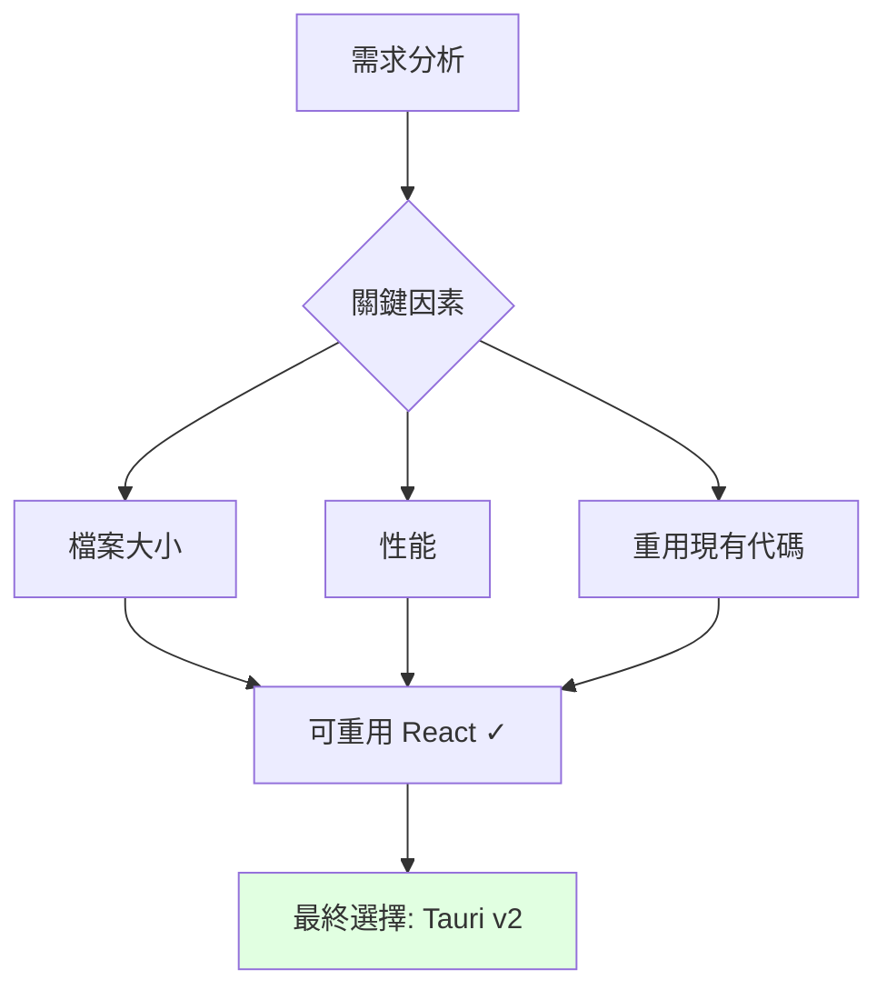
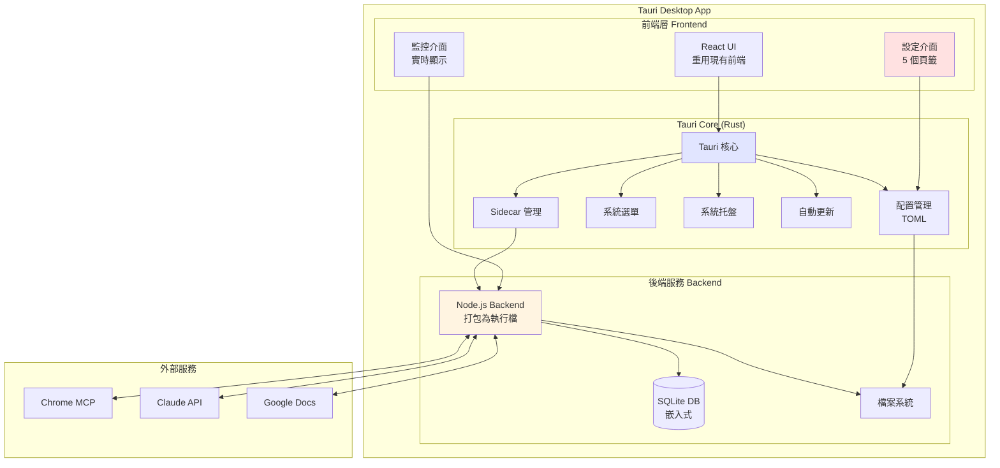
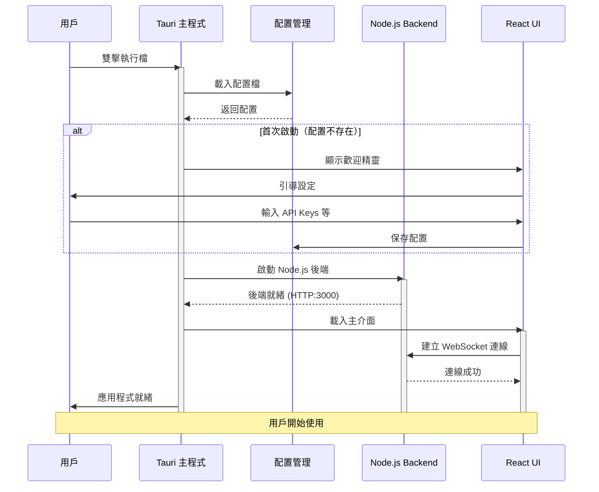

# AutoDoc Agent v2.0 - Desktop Application Overview

## 📋 文檔索引

這是 AutoDoc Agent v2.0 桌面應用程式的主文檔。完整功能分為以下文檔：

1. **本文檔** (`v2_desktop_overview.md`) - 概述與技術方案選擇
2. [`v2_desktop_task12.md`](v2_desktop_task12.md) - Task 12 詳細實作
3. [`v2_desktop_gui.md`](v2_desktop_gui.md) - GUI 設定介面設計
4. [`v2_desktop_packaging.md`](v2_desktop_packaging.md) - 打包與發佈策略
5. [`v2_desktop_implementation.md`](v2_desktop_implementation.md) - 實施計劃與測試

---

## 🎯 v2.0 目標

**將 AutoDoc Agent 打包為可攜帶式的跨平台桌面應用程式**

### 核心需求

✅ **單一執行檔**：無需手動安裝依賴  
✅ **跨平台**：Windows, macOS, Linux  
✅ **圖形化設定**：避免編輯 .env 或 .ini  
✅ **開箱即用**：一鍵啟動，無配置  
✅ **自動更新**：內建更新機制  
✅ **輕量級**：打包大小 ~15MB

### 使用情境


---

## 🔍 技術方案選擇

### 桌面框架比較

| 特性 | Tauri ⭐ 推薦 | Electron | Flutter Desktop |
|------|--------------|----------|-----------------|
| **檔案大小** | ~15MB | ~180MB | ~40MB |
| **記憶體佔用** | ~50MB | ~150MB+ | ~80MB |
| **啟動速度** | 快（<2秒） | 中等（3-5秒） | 快（<2秒） |
| **前端技術** | React (重用) | React (重用) | Dart (重寫) |
| **安全性** | 高（Rust） | 中等 | 高 |
| **跨平台** | Win/Mac/Linux | Win/Mac/Linux | Win/Mac/Linux |
| **生態系統** | 較新 | 成熟 | 較小 |
| **學習曲線** | 中等 | 低 | 高 |

### 決策：選擇 Tauri v2 ⭐



**選擇理由**：

1. **輕量級**：
   - 打包大小僅 15MB（vs Electron 180MB）
   - 使用系統 WebView，不內建瀏覽器引擎
   
2. **高性能**：
   - Rust 後端，原生性能
   - 記憶體佔用低（~50MB vs Electron 150MB+）
   
3. **安全性**：
   - Rust 的記憶體安全保證
   - 嚴格的權限控制（不像 Electron 預設權限過大）
   
4. **前端重用**：
   - 可直接使用現有的 React + TypeScript 前端
   - 無需學習新技術或重寫
   
5. **跨平台**：
   - Windows: WebView2 (Edge Chromium)
   - macOS: WKWebView (Safari)
   - Linux: WebKitGTK
   
6. **現代化**：
   - Tauri v2 已經穩定
   - 活躍的社群支援
   - 良好的文檔

---

## 🏗️ 系統架構

### 整體架構



### 技術堆疊

**前端**：
- React 18
- TypeScript
- Tailwind CSS
- Ant Design (設定介面)
- Tauri API (@tauri-apps/api)

**Tauri 後端 (Rust)**：
- tauri v2.0
- serde (序列化)
- confy (配置管理)
- tokio (非同步)
- rusqlite (SQLite)

**Node.js 後端**：
- Express.js
- ws (WebSocket)
- 打包工具：pkg (Vercel)

**資料庫**：
- SQLite (嵌入式)

---

## 📂 專案結構

```
autodoc-agent/
├── desktop/                          # v2.0 桌面應用程式
│   ├── src-tauri/                   # Tauri Rust 後端
│   │   ├── src/
│   │   │   ├── main.rs              # 主程式入口
│   │   │   ├── config.rs            # 配置管理
│   │   │   ├── sidecar.rs           # Node.js Sidecar 管理
│   │   │   ├── menu.rs              # 應用程式選單
│   │   │   ├── tray.rs              # 系統托盤
│   │   │   └── updater.rs           # 自動更新
│   │   ├── tauri.conf.json          # Tauri 配置
│   │   ├── Cargo.toml               # Rust 依賴
│   │   ├── build.rs                 # 編譯腳本
│   │   └── icons/                   # 應用程式圖示
│   │       ├── icon.ico             # Windows
│   │       ├── icon.icns            # macOS
│   │       └── icon.png             # Linux
│   │
│   ├── src/                         # React 前端（重用現有）
│   │   ├── components/
│   │   │   ├── SettingsWindow.tsx  # 設定視窗
│   │   │   ├── WelcomeWizard.tsx   # 首次啟動精靈
│   │   │   └── ...
│   │   └── ...
│   │
│   ├── backend-bundle/              # 打包的 Node.js 後端
│   │   ├── backend-win.exe          # Windows 執行檔
│   │   ├── backend-macos            # macOS 執行檔
│   │   └── backend-linux            # Linux 執行檔
│   │
│   ├── package.json
│   └── README.md
│
├── backend/                         # v1.0 Node.js 後端（原有）
├── frontend/                        # v1.0 React 前端（原有）
└── docs/                            # v2.0 文檔
    ├── v2_desktop_overview.md       # 本文檔
    ├── v2_desktop_task12.md         # Task 12 實作
    ├── v2_desktop_gui.md            # GUI 設計
    ├── v2_desktop_packaging.md      # 打包策略
    └── v2_desktop_implementation.md # 實施計劃
```

---

## 🚀 啟動流程



---

## 💾 配置管理

### 配置檔案位置（跨平台）

| 平台 | 配置檔案路徑 |
|------|-------------|
| **Windows** | `%APPDATA%\AutoDoc\config.toml` |
| **macOS** | `~/Library/Application Support/AutoDoc/config.toml` |
| **Linux** | `~/.config/AutoDoc/config.toml` |

### 配置結構

```toml
[basic]
app_name = "AutoDoc Agent"
language = "zh-TW"
auto_start = false
minimize_to_tray = true
check_updates = true

[auth]
claude_api_key = ""
claude_model = "claude-sonnet-4-20250514"
chrome_mcp_url = "http://localhost"
chrome_mcp_port = 3001
target_auth_type = "none"

[exploration]
strategy = "importance"
max_depth = 5
max_pages = 100
screenshot_quality = "medium"
network_timeout = 30
wait_for_network_idle = true

[storage]
snapshot_storage_path = "~/Documents/AutoDoc/snapshots"
screenshot_storage_path = "~/Documents/AutoDoc/screenshots"
database_path = "~/Documents/AutoDoc/autodoc.db"
enable_compression = true
auto_cleanup = false
retention_days = 0

[advanced]
log_level = "info"
enable_telemetry = false
concurrent_tabs = 3
api_rate_limit = 20
```

---

## 🎨 用戶介面預覽

### 主視窗

```
┌────────────────────────────────────────────────────┐
│  🤖 AutoDoc Agent                   ⚙️ 設定  ❌ 關閉 │
├────────────────────────────────────────────────────┤
│                                                    │
│  📝 新增探索任務                                    │
│  ┌──────────────────────────────────────────────┐ │
│  │ 產品 URL: [https://example.com/app        ] │ │
│  │                                              │ │
│  │ 探索策略: [重要性優先 ▼]                    │ │
│  │                                              │ │
│  │ 最大深度: ●────○──────── 5                  │ │
│  │                                              │ │
│  │         [開始探索]                           │ │
│  └──────────────────────────────────────────────┘ │
│                                                    │
│  📊 進行中的任務                                    │
│  ┌──────────────────────────────────────────────┐ │
│  │ ▶ Product A - 探索中... (45%)               │ │
│  │   已探索: 45/100 頁面                        │ │
│  └──────────────────────────────────────────────┘ │
│                                                    │
│  📚 已完成的專案                                    │
│  ┌──────────────────────────────────────────────┐ │
│  │ • Product B - v1.0.0 (2025-11-01)           │ │
│  │ • Product C - v2.1.3 (2025-11-08)           │ │
│  └──────────────────────────────────────────────┘ │
│                                                    │
└────────────────────────────────────────────────────┘
```

### 系統托盤

```
┌─────────────────────┐
│ 🤖 AutoDoc Agent    │
├─────────────────────┤
│ 📝 顯示主視窗        │
│ ⚙️ 設定              │
│ ℹ️ 關於              │
│ ─────────────────   │
│ ❌ 退出              │
└─────────────────────┘
```

---

## 📊 功能比較

| 功能 | v1.0 (Web App) | v2.0 (Desktop) |
|------|----------------|----------------|
| **部署方式** | 需安裝環境 | 單一執行檔 |
| **啟動方式** | `npm start` | 雙擊執行 |
| **配置方式** | 編輯 .env | 圖形化介面 |
| **更新方式** | `git pull` | 自動更新 |
| **系統托盤** | ❌ | ✅ |
| **開機啟動** | ❌ | ✅ |
| **檔案大小** | 依賴（數百MB） | 15MB |
| **記憶體佔用** | ~200MB | ~50MB |
| **適用對象** | 開發者 | 所有用戶 |

---

## 🎯 下一步

1. 閱讀 [Task 12 詳細實作](v2_desktop_task12.md) - 了解具體開發任務
2. 閱讀 [GUI 設定介面設計](v2_desktop_gui.md) - 了解介面設計細節
3. 閱讀 [打包與發佈策略](v2_desktop_packaging.md) - 了解如何打包發佈
4. 閱讀 [實施計劃](v2_desktop_implementation.md) - 了解開發時程與測試

---

## 📚 學習資源

### Tauri 官方資源
- 官方文檔：https://tauri.app/v2/
- GitHub：https://github.com/tauri-apps/tauri
- Discord 社群：https://discord.com/invite/tauri

### 範例專案
- 1Password（使用 Tauri）
- Warp Terminal（使用 Tauri）
- Bitwarden Desktop（Electron，但可參考設計）

---

## ❓ 常見問題

### Q1: 為什麼選擇 Tauri？
**A**: 輕量（15MB）、安全（Rust）、快速（原生性能），且可重用現有 React 前端。

### Q2: 支援哪些平台？
**A**: Windows 10+, macOS 12+, Ubuntu 20.04+（及其他主流 Linux 發行版）。

### Q3: 需要重寫前端嗎？
**A**: 不需要！可直接重用現有的 React 前端，只需添加 Tauri API 調用。

### Q4: 用戶資料存在哪裡？
**A**: 配置在系統標準位置，快照與資料庫可由用戶自定義（預設在 `~/Documents/AutoDoc/`）。

### Q5: 如何更新應用程式？
**A**: 內建自動更新機制，用戶只需點擊「檢查更新」即可。

---

**文檔版本**: 2.0  
**建立日期**: 2025-11-10  
**狀態**: Phase 2 規劃中

**下一份文檔**: [Task 12 詳細實作 →](v2_desktop_task12.md)
