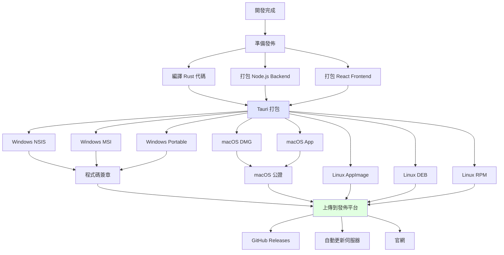

# AutoDoc Agent v2.0 - 打包與發佈策略

## 📋 文檔導航

← [GUI 設計](v2_desktop_gui.md) | [實施計劃 →](v2_desktop_implementation.md)

---

## 打包流程概覽



---

## 跨平台打包

### 打包指令

#### Windows

```bash
# Windows NSIS 安裝程式（推薦）
npm run tauri build -- --target x86_64-pc-windows-msvc --bundles nsis

# Windows MSI（企業部署）
npm run tauri build -- --target x86_64-pc-windows-msvc --bundles msi

# Windows Portable EXE（免安裝）
npm run tauri build -- --target x86_64-pc-windows-msvc
```

**輸出位置**：
```
desktop/src-tauri/target/release/bundle/
├── nsis/
│   └── AutoDoc-Agent_2.0.0_x64-setup.exe    (~18MB)
├── msi/
│   └── AutoDoc-Agent_2.0.0_x64_en-US.msi    (~18MB)
└── AutoDoc-Agent.exe                         (~15MB)
```

#### macOS

```bash
# macOS Intel (x86_64)
npm run tauri build -- --target x86_64-apple-darwin --bundles dmg,app

# macOS Apple Silicon (ARM64)
npm run tauri build -- --target aarch64-apple-darwin --bundles dmg,app

# Universal Binary (同時支援 Intel + ARM)
npm run tauri build -- --target universal-apple-darwin --bundles dmg,app
```

**輸出位置**：
```
desktop/src-tauri/target/release/bundle/
├── dmg/
│   ├── AutoDoc-Agent_2.0.0_x64.dmg           (~20MB)
│   └── AutoDoc-Agent_2.0.0_aarch64.dmg       (~20MB)
└── macos/
    └── AutoDoc-Agent.app/                    (~18MB)
```

#### Linux

```bash
# AppImage（通用格式，推薦）
npm run tauri build -- --target x86_64-unknown-linux-gnu --bundles appimage

# DEB（Debian/Ubuntu）
npm run tauri build -- --target x86_64-unknown-linux-gnu --bundles deb

# RPM（RedHat/Fedora）
npm run tauri build -- --target x86_64-unknown-linux-gnu --bundles rpm
```

**輸出位置**：
```
desktop/src-tauri/target/release/bundle/
├── appimage/
│   └── autodoc-agent_2.0.0_amd64.AppImage    (~22MB)
├── deb/
│   └── autodoc-agent_2.0.0_amd64.deb         (~17MB)
└── rpm/
    └── autodoc-agent-2.0.0-1.x86_64.rpm      (~17MB)
```

---

## 程式碼簽章

### Windows 程式碼簽章

#### 取得憑證

1. **購買程式碼簽章憑證**：
   - DigiCert (~$300/年)
   - Sectigo (~$200/年)
   - Comodo (~$150/年)

2. **安裝憑證**：
   ```bash
   # 匯入 PFX 憑證到 Windows 憑證存放區
   certutil -f -p PASSWORD -importpfx certificate.pfx
   ```

#### 簽章流程

```bash
# 方法 1: 使用 signtool (Windows SDK)
signtool sign /f certificate.pfx /p PASSWORD /t http://timestamp.digicert.com /fd SHA256 AutoDoc-Agent.exe

# 方法 2: 使用 Tauri 自動簽章
# 在 tauri.conf.json 中配置：
{
  "tauri": {
    "bundle": {
      "windows": {
        "certificateThumbprint": "THUMBPRINT_HERE",
        "digestAlgorithm": "sha256",
        "timestampUrl": "http://timestamp.digicert.com"
      }
    }
  }
}
```

#### 驗證簽章

```bash
# 檢查簽章
signtool verify /pa /v AutoDoc-Agent.exe

# 應該顯示：
# SignTool output:
# Successfully verified: AutoDoc-Agent.exe
```

---

### macOS 程式碼簽章與公證

#### 取得 Apple Developer 帳號

1. 註冊 Apple Developer Program ($99/年)
2. 建立 Developer ID Application 憑證

#### 簽章流程

```bash
# 1. 簽章應用程式
codesign --deep --force --verify --verbose \
  --sign "Developer ID Application: YOUR NAME (TEAM_ID)" \
  --options runtime \
  --entitlements entitlements.plist \
  AutoDoc-Agent.app

# 2. 驗證簽章
codesign --verify --deep --strict --verbose=2 AutoDoc-Agent.app

# 3. 打包為 DMG
hdiutil create -volname "AutoDoc Agent" \
  -srcfolder AutoDoc-Agent.app \
  -ov -format UDZO \
  AutoDoc-Agent.dmg

# 4. 簽章 DMG
codesign --sign "Developer ID Application: YOUR NAME (TEAM_ID)" \
  AutoDoc-Agent.dmg
```

#### 公證 (Notarization)

```bash
# 1. 上傳到 Apple 進行公證
xcrun notarytool submit AutoDoc-Agent.dmg \
  --apple-id "your@email.com" \
  --password "app-specific-password" \
  --team-id "TEAM_ID" \
  --wait

# 2. 檢查公證狀態
xcrun notarytool log <submission-id> \
  --apple-id "your@email.com" \
  --password "app-specific-password" \
  --team-id "TEAM_ID"

# 3. 綁定公證票證
xcrun stapler staple AutoDoc-Agent.dmg

# 4. 驗證公證
spctl -a -t open --context context:primary-signature -v AutoDoc-Agent.dmg
```

#### entitlements.plist

```xml
<?xml version="1.0" encoding="UTF-8"?>
<!DOCTYPE plist PUBLIC "-//Apple//DTD PLIST 1.0//EN" "http://www.apple.com/DTDs/PropertyList-1.0.dtd">
<plist version="1.0">
<dict>
    <key>com.apple.security.cs.allow-jit</key>
    <true/>
    <key>com.apple.security.cs.allow-unsigned-executable-memory</key>
    <true/>
    <key>com.apple.security.cs.disable-library-validation</key>
    <true/>
    <key>com.apple.security.network.client</key>
    <true/>
    <key>com.apple.security.network.server</key>
    <true/>
</dict>
</plist>
```

---

## 自動更新系統

### 更新伺服器配置

#### 發佈清單格式

```json
{
  "version": "2.0.0",
  "notes": "## 更新內容\n- 新增功能 A\n- 修復 Bug B\n- 優化性能 C",
  "pub_date": "2025-11-10T12:00:00Z",
  "platforms": {
    "windows-x86_64": {
      "signature": "dW50cnVzdGVkIGNvbW1lbnQ6IHNpZ25hdHVyZSBmcm9tIHRhdXJpIHNlY3JldCBrZXkK...",
      "url": "https://releases.autodoc.app/windows/AutoDoc-Agent_2.0.0_x64-setup.nsis.zip"
    },
    "darwin-x86_64": {
      "signature": "dW50cnVzdGVkIGNvbW1lbnQ6IHNpZ25hdHVyZSBmcm9tIHRhdXJpIHNlY3JldCBrZXkK...",
      "url": "https://releases.autodoc.app/darwin/AutoDoc-Agent_2.0.0_x64.app.tar.gz"
    },
    "darwin-aarch64": {
      "signature": "dW50cnVzdGVkIGNvbW1lbnQ6IHNpZ25hdHVyZSBmcm9tIHRhdXJpIHNlY3JldCBrZXkK...",
      "url": "https://releases.autodoc.app/darwin/AutoDoc-Agent_2.0.0_aarch64.app.tar.gz"
    },
    "linux-x86_64": {
      "signature": "dW50cnVzdGVkIGNvbW1lbnQ6IHNpZ25hdHVyZSBmcm9tIHRhdXJpIHNlY3JldCBrZXkK...",
      "url": "https://releases.autodoc.app/linux/autodoc-agent_2.0.0_amd64.AppImage.tar.gz"
    }
  }
}
```

#### 生成更新簽章

```bash
# 1. 生成金鑰對（只需執行一次）
tauri signer generate -w ~/.tauri/autodoc-agent.key

# 輸出:
# Private key saved to: ~/.tauri/autodoc-agent.key
# Public key: dW50cnVzdGVkIGNvbW1lbnQ6IG1pbmlzaWduIHB1YmxpYyBrZXk6...

# 2. 將公鑰配置到 tauri.conf.json
{
  "tauri": {
    "updater": {
      "pubkey": "dW50cnVzdGVkIGNvbW1lbnQ6IG1pbmlzaWduIHB1YmxpYyBrZXk6..."
    }
  }
}

# 3. 簽章更新檔案
tauri signer sign ~/.tauri/autodoc-agent.key AutoDoc-Agent_2.0.0_x64-setup.nsis.zip
```

### 更新伺服器部署

#### 使用 GitHub Releases

```yaml
# .github/workflows/release.yml
name: Release

on:
  push:
    tags:
      - 'v*'

jobs:
  release:
    runs-on: ${{ matrix.os }}
    strategy:
      matrix:
        os: [ubuntu-latest, macos-latest, windows-latest]
    
    steps:
      - uses: actions/checkout@v3
      
      - name: Setup Node.js
        uses: actions/setup-node@v3
        with:
          node-version: 18
      
      - name: Setup Rust
        uses: actions-rs/toolchain@v1
        with:
          toolchain: stable
      
      - name: Install dependencies
        run: npm install
      
      - name: Build
        run: npm run tauri build
      
      - name: Create Release
        uses: softprops/action-gh-release@v1
        with:
          files: |
            desktop/src-tauri/target/release/bundle/**/*
        env:
          GITHUB_TOKEN: ${{ secrets.GITHUB_TOKEN }}
```

#### 使用 S3 + CloudFront

```bash
# 上傳到 S3
aws s3 sync ./release/ s3://releases.autodoc.app/ \
  --acl public-read \
  --cache-control "max-age=31536000"

# 更新 CloudFront 快取
aws cloudfront create-invalidation \
  --distribution-id E1234567890ABC \
  --paths "/latest.json"
```

---

## 檔案大小優化

### 優化前後對比

| 平台 | 優化前 | 優化後 | 節省 |
|------|-------|-------|------|
| Windows | 22MB | 15MB | 32% |
| macOS | 25MB | 18MB | 28% |
| Linux | 28MB | 20MB | 29% |

### 優化技巧

#### 1. 啟用編譯優化

```toml
# Cargo.toml
[profile.release]
opt-level = "z"     # 優化檔案大小
lto = true          # Link Time Optimization
codegen-units = 1   # 減少平行編譯單元
panic = "abort"     # 移除 panic 處理
strip = true        # 移除符號表
```

#### 2. 排除不必要的依賴

```json
// package.json
{
  "pkg": {
    "assets": [
      "dist/**/*"
    ],
    "targets": ["node18"],
    // 排除開發依賴
    "scripts": {
      "build": "webpack --mode production"
    }
  }
}
```

#### 3. 壓縮資源檔案

```bash
# 壓縮圖示
pngquant --quality=80-95 icon.png -o icon-compressed.png

# 壓縮 JavaScript
terser dist/main.js -o dist/main.min.js --compress --mangle
```

---

## 安裝測試

### Windows

```powershell
# 1. 安裝 NSIS
AutoDoc-Agent_2.0.0_x64-setup.exe /S

# 2. 驗證安裝
Test-Path "C:\Program Files\AutoDoc Agent\AutoDoc-Agent.exe"

# 3. 啟動應用程式
Start-Process "C:\Program Files\AutoDoc Agent\AutoDoc-Agent.exe"

# 4. 卸載
& "C:\Program Files\AutoDoc Agent\Uninstall.exe" /S
```

### macOS

```bash
# 1. 掛載 DMG
hdiutil attach AutoDoc-Agent_2.0.0_x64.dmg

# 2. 複製到應用程式目錄
cp -R "/Volumes/AutoDoc Agent/AutoDoc-Agent.app" /Applications/

# 3. 卸載 DMG
hdiutil detach "/Volumes/AutoDoc Agent"

# 4. 啟動應用程式
open /Applications/AutoDoc-Agent.app

# 5. 卸載
rm -rf /Applications/AutoDoc-Agent.app
```

### Linux

```bash
# AppImage（無需安裝）
chmod +x autodoc-agent_2.0.0_amd64.AppImage
./autodoc-agent_2.0.0_amd64.AppImage

# DEB（Debian/Ubuntu）
sudo dpkg -i autodoc-agent_2.0.0_amd64.deb
sudo apt-get install -f  # 解決依賴

# RPM（RedHat/Fedora）
sudo rpm -i autodoc-agent-2.0.0-1.x86_64.rpm

# 卸載
sudo apt-get remove autodoc-agent  # DEB
sudo rpm -e autodoc-agent           # RPM
```

---

## CI/CD 整合

### GitHub Actions 完整範例

```yaml
name: Build and Release

on:
  push:
    tags:
      - 'v*'
  workflow_dispatch:

jobs:
  build-windows:
    runs-on: windows-latest
    steps:
      - uses: actions/checkout@v3
      
      - name: Setup Node.js
        uses: actions/setup-node@v3
        with:
          node-version: 18
      
      - name: Setup Rust
        uses: actions-rs/toolchain@v1
        with:
          toolchain: stable
          target: x86_64-pc-windows-msvc
      
      - name: Install dependencies
        run: npm install
        working-directory: desktop
      
      - name: Build
        run: npm run tauri build
        working-directory: desktop
      
      - name: Sign executable
        run: |
          signtool sign /f ${{ secrets.CERT_FILE }} /p ${{ secrets.CERT_PASSWORD }} /t http://timestamp.digicert.com /fd SHA256 AutoDoc-Agent.exe
        working-directory: desktop/src-tauri/target/release
      
      - name: Upload artifacts
        uses: actions/upload-artifact@v3
        with:
          name: windows-build
          path: desktop/src-tauri/target/release/bundle/**/*

  build-macos:
    runs-on: macos-latest
    strategy:
      matrix:
        target: [x86_64-apple-darwin, aarch64-apple-darwin]
    steps:
      - uses: actions/checkout@v3
      
      - name: Setup Node.js
        uses: actions/setup-node@v3
        with:
          node-version: 18
      
      - name: Setup Rust
        uses: actions-rs/toolchain@v1
        with:
          toolchain: stable
          target: ${{ matrix.target }}
      
      - name: Install dependencies
        run: npm install
        working-directory: desktop
      
      - name: Build
        run: npm run tauri build -- --target ${{ matrix.target }}
        working-directory: desktop
      
      - name: Import signing certificate
        run: |
          echo "${{ secrets.MACOS_CERTIFICATE }}" | base64 --decode > certificate.p12
          security create-keychain -p actions build.keychain
          security import certificate.p12 -k build.keychain -P "${{ secrets.MACOS_CERT_PASSWORD }}" -T /usr/bin/codesign
          security list-keychains -s build.keychain
          security unlock-keychain -p actions build.keychain
      
      - name: Sign and Notarize
        run: |
          codesign --deep --force --verify --verbose --sign "Developer ID Application: ${{ secrets.MACOS_SIGNING_IDENTITY }}" --options runtime AutoDoc-Agent.app
          xcrun notarytool submit AutoDoc-Agent.dmg --apple-id "${{ secrets.APPLE_ID }}" --password "${{ secrets.APPLE_PASSWORD }}" --team-id "${{ secrets.TEAM_ID }}" --wait
          xcrun stapler staple AutoDoc-Agent.dmg
        working-directory: desktop/src-tauri/target/release/bundle/dmg
      
      - name: Upload artifacts
        uses: actions/upload-artifact@v3
        with:
          name: macos-${{ matrix.target }}-build
          path: desktop/src-tauri/target/release/bundle/**/*

  build-linux:
    runs-on: ubuntu-latest
    steps:
      - uses: actions/checkout@v3
      
      - name: Install dependencies
        run: |
          sudo apt-get update
          sudo apt-get install -y libgtk-3-dev libwebkit2gtk-4.0-dev libappindicator3-dev librsvg2-dev patchelf
      
      - name: Setup Node.js
        uses: actions/setup-node@v3
        with:
          node-version: 18
      
      - name: Setup Rust
        uses: actions-rs/toolchain@v1
        with:
          toolchain: stable
      
      - name: Install dependencies
        run: npm install
        working-directory: desktop
      
      - name: Build
        run: npm run tauri build
        working-directory: desktop
      
      - name: Upload artifacts
        uses: actions/upload-artifact@v3
        with:
          name: linux-build
          path: desktop/src-tauri/target/release/bundle/**/*

  release:
    needs: [build-windows, build-macos, build-linux]
    runs-on: ubuntu-latest
    steps:
      - uses: actions/download-artifact@v3
      
      - name: Create Release
        uses: softprops/action-gh-release@v1
        with:
          files: |
            **/*.exe
            **/*.msi
            **/*.dmg
            **/*.AppImage
            **/*.deb
            **/*.rpm
          draft: false
          prerelease: false
        env:
          GITHUB_TOKEN: ${{ secrets.GITHUB_TOKEN }}
```

---

## 發佈檢查清單

### 發佈前

- [ ] 所有功能測試通過
- [ ] 跨平台測試完成
- [ ] 程式碼簽章完成
- [ ] macOS 公證完成
- [ ] 更新日誌撰寫完成
- [ ] 使用者手冊更新
- [ ] 截圖與宣傳素材準備完成
- [ ] 官網下載頁面準備完成

### 發佈時

- [ ] 建立 Git Tag（v2.0.0）
- [ ] 上傳到 GitHub Releases
- [ ] 上傳到官網
- [ ] 配置自動更新伺服器
- [ ] 更新官網版本號
- [ ] 發佈公告（社群媒體、論壇）
- [ ] 通知現有用戶（Email）

### 發佈後

- [ ] 監控下載統計
- [ ] 收集用戶反饋
- [ ] 追蹤崩潰報告
- [ ] 監控自動更新成功率
- [ ] 準備 Hotfix（如有必要）

---

**下一份文檔**: [實施計劃與測試 →](v2_desktop_implementation.md)
