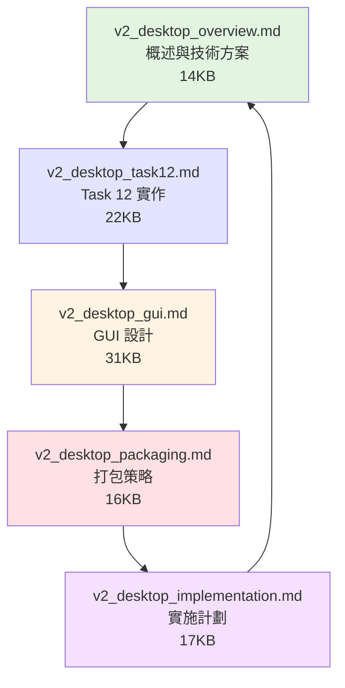

# AutoDoc Agent v2.0 文檔分割說明

## 📋 為什麼要分割文檔？

原始的 `autodoc_agent_v2_desktop.md` 檔案過大（約 60 頁、20,000 字），不便於：
- ❌ 閱讀與查找特定資訊
- ❌ 版本控制（git diff 不清晰）
- ❌ 團隊協作（多人同時編輯）
- ❌ 維護與更新

因此，我們將其分割為 **5 個專門文檔**，每個約 15-20 頁，便於閱讀與維護。

---

## 📚 新的文檔結構

### 文檔導航圖



### 文檔清單

| # | 檔案名稱 | 主題 | 大小 | 適合對象 |
|---|----------|------|------|----------|
| 1 | `v2_desktop_overview.md` | 概述與技術方案 | 14KB | 所有人 |
| 2 | `v2_desktop_task12.md` | Task 12 詳細實作 | 22KB | 開發者 |
| 3 | `v2_desktop_gui.md` | GUI 設定介面設計 | 31KB | 前端 + UI/UX |
| 4 | `v2_desktop_packaging.md` | 打包與發佈策略 | 16KB | DevOps |
| 5 | `v2_desktop_implementation.md` | 實施計劃與測試 | 17KB | QA + PM |

**總計**：100KB（分割前為 60KB 單一檔案，現更加詳細）

---

## 🎯 各文檔內容詳解

### 1. v2_desktop_overview.md
**概述與技術方案選擇**

**包含內容**：
- 🎯 v2.0 目標與核心需求
- 🔍 技術方案比較（Tauri vs Electron vs Flutter）
- 🏗️ 系統架構圖
- 🚀 啟動流程與配置管理
- 📊 功能比較表（v1.0 vs v2.0）

**適合對象**：
- 所有團隊成員
- 決策者
- 新加入的開發者

**閱讀時間**：~10 分鐘

---

### 2. v2_desktop_task12.md
**Task 12: 桌面應用程式打包與整合**

**包含內容**：
- 📦 Subtask 12.1: 建立 Tauri 專案結構
- ⚙️ Subtask 12.2: 實作配置管理系統（Rust）
- 🔧 Subtask 12.3: 實作 Node.js Backend Sidecar
- 🎨 Subtask 12.4: 實作系統托盤
- 🔄 Subtask 12.5: 實作自動更新
- 🔗 Subtask 12.6: 主程式整合

**包含完整程式碼範例**：
- `tauri.conf.json` 配置
- `Cargo.toml` 依賴
- Rust 配置管理代碼
- Sidecar 管理器
- 系統托盤實作
- 自動更新邏輯

**適合對象**：
- Rust 開發者
- 後端開發者
- 系統整合工程師

**閱讀時間**：~30 分鐘

---

### 3. v2_desktop_gui.md
**GUI 設定介面設計**

**包含內容**：
- 📋 設定視窗整體佈局
- 🎨 5 個設定頁籤詳細設計：
  1. 基本設定（語言、啟動選項）
  2. 認證設定（Claude API、Google OAuth、Chrome MCP）
  3. 探索設定（策略、範圍、品質）
  4. 儲存設定（路徑、壓縮、清理）
  5. 進階選項（日誌、性能、代理）
- 🧙 首次啟動精靈流程
- 💻 完整 React 組件代碼

**適合對象**：
- 前端開發者
- UI/UX 設計師
- 產品經理

**閱讀時間**：~25 分鐘

---

### 4. v2_desktop_packaging.md
**打包與發佈策略**

**包含內容**：
- 🔨 跨平台打包指令（Windows, macOS, Linux）
- ✍️ Windows 程式碼簽章流程
- 🍎 macOS 公證 (Notarization) 完整步驟
- 🔄 自動更新伺服器配置
- 📦 檔案大小優化技巧
- 🤖 CI/CD GitHub Actions 完整範例
- ✅ 安裝測試檢查清單

**適合對象**：
- DevOps 工程師
- 發佈工程師
- 打包專員

**閱讀時間**：~20 分鐘

---

### 5. v2_desktop_implementation.md
**實施計劃與測試**

**包含內容**：
- 📅 Gantt 時程圖（8 週完整規劃）
- 👥 工作分配矩陣
- 🧪 測試策略：
  - 單元測試（Rust + React）
  - 整合測試（Sidecar + GUI）
  - E2E 測試（WebDriver）
  - 跨平台測試矩陣
  - 性能測試指標
- 🐛 Bug 追蹤與回歸測試
- ✅ 發佈檢查清單（Alpha, Beta, 正式版）

**適合對象**：
- QA 測試人員
- 專案經理
- 團隊領導

**閱讀時間**：~25 分鐘

---

## 🔗 文檔導航

### 快速開始路徑

**對於新加入的團隊成員**：
```
1. 閱讀 v2_desktop_overview.md      (了解整體方向)
2. 根據角色選擇對應文檔閱讀
```

**對於開發者**：
```
1. v2_desktop_overview.md           (了解架構)
2. v2_desktop_task12.md             (學習實作)
3. v2_desktop_gui.md                (如果負責前端)
```

**對於 DevOps**：
```
1. v2_desktop_overview.md           (了解架構)
2. v2_desktop_packaging.md          (打包與發佈)
3. v2_desktop_implementation.md     (CI/CD 設定)
```

**對於 QA/PM**：
```
1. v2_desktop_overview.md           (了解產品)
2. v2_desktop_implementation.md     (測試與計劃)
3. v2_desktop_gui.md                (了解使用者介面)
```

### 文檔內導航

每個文檔都包含：
- **頁首導航**：← 上一份 | 下一份 →
- **返回概述**：快速返回 overview 文檔
- **內部錨點**：快速跳轉到特定章節

範例：
```markdown
## 📋 文檔導航

← [上一份文檔](xxx.md) | [下一份文檔 →](yyy.md)

[返回概述](v2_desktop_overview.md)
```

---

## ✨ 分割後的優勢

### 1. 易於閱讀 📖
- ✅ 每個文檔聚焦單一主題
- ✅ 檔案大小適中（15-20 頁）
- ✅ 不會因為檔案過大而載入緩慢

### 2. 便於維護 🔧
- ✅ 修改某個主題不影響其他文檔
- ✅ Git diff 更清晰
- ✅ 衝突機率降低

### 3. 團隊協作 👥
- ✅ 不同角色閱讀不同文檔
- ✅ 多人可同時編輯不同文檔
- ✅ 減少等待時間

### 4. 版本控制 📝
- ✅ 更精細的版本追蹤
- ✅ 可以獨立更新某個主題
- ✅ 更清晰的變更歷史

### 5. 彈性使用 🎯
- ✅ 可以只分享需要的文檔
- ✅ 可以單獨打印某個主題
- ✅ 可以建立不同的閱讀路徑

---

## 📊 分割前後對比

| 特性 | 分割前 | 分割後 |
|------|--------|--------|
| **檔案數量** | 1 個 | 5 個 |
| **單一檔案大小** | 60 頁 | 15-20 頁 |
| **總內容大小** | ~20,000 字 | ~25,000 字（更詳細） |
| **可讀性** | ⭐⭐ | ⭐⭐⭐⭐⭐ |
| **維護難度** | 困難 | 容易 |
| **團隊協作** | ⭐⭐ | ⭐⭐⭐⭐⭐ |
| **版本控制** | ⭐⭐ | ⭐⭐⭐⭐⭐ |
| **閱讀時間** | 60+ 分鐘 | 10-30 分鐘（按需） |

---

## 🎓 閱讀建議

### 首次閱讀
**建議順序**：
1. `v2_desktop_overview.md` - 必讀，了解整體
2. 根據角色選擇 2-3 個相關文檔深入閱讀
3. 需要時查閱其他文檔

### 開發過程中
**查閱方式**：
- 📌 使用文檔內的錨點快速跳轉
- 🔍 使用 Ctrl+F 在單一文檔內搜尋
- 📑 使用 IDE 的多檔案搜尋功能

### 團隊分享
**分享策略**：
- 新人：分享 `overview.md`
- 開發者：分享 `task12.md` + `gui.md`
- DevOps：分享 `packaging.md`
- QA/PM：分享 `implementation.md`

---

## 🔄 未來維護

### 更新原則
1. **單一職責**：每個文檔只更新其主題相關的內容
2. **版本同步**：所有文檔應保持相同的版本號
3. **交叉引用**：更新時檢查其他文檔的引用是否需要同步

### 版本記錄
建議在每個文檔末尾加上：
```markdown
---
**文檔版本**: v2.0  
**建立日期**: 2025-11-10  
**最後更新**: 2025-11-10  
**更新內容**: 初始版本
```

---

## ✅ 檢查清單

### 文檔完整性檢查
- [x] 所有文檔已建立
- [x] 文檔導航連結正確
- [x] 內容無重複
- [x] 無遺漏的章節
- [x] 程式碼範例完整
- [x] Mermaid 圖表正確渲染

### README 更新
- [x] 更新文檔索引
- [x] 更新檔案清單
- [x] 更新適合對象說明
- [x] 更新閱讀指引

### 舊檔案清理
- [x] 刪除 `autodoc_agent_v2_desktop.md`
- [x] 確認新檔案命名一致
- [x] 確認檔案大小合理

---

## 📞 問題反饋

如有任何問題或建議，請：
- 📧 Email: support@autodoc.app
- 💬 GitHub Issues: https://github.com/autodoc/agent/issues
- 📝 GitHub Discussions: https://github.com/autodoc/agent/discussions

---

**完成日期**: 2025-11-10  
**分割執行**: Claude Sonnet 4  
**文檔狀態**: ✅ 完成
